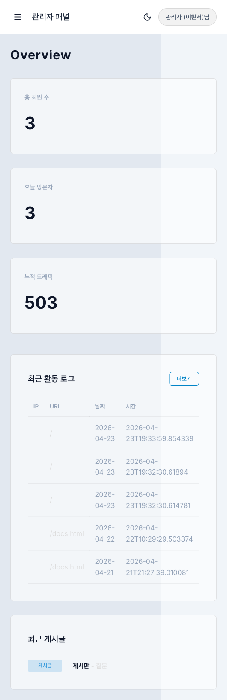
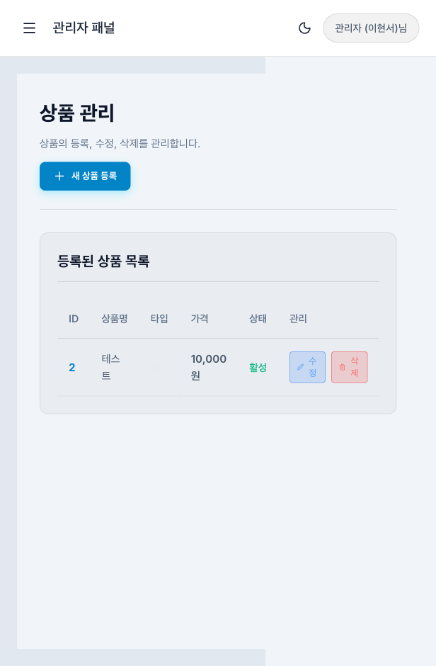
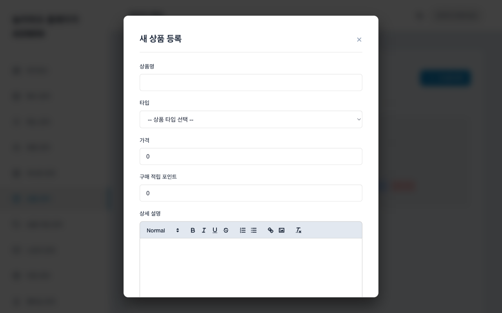
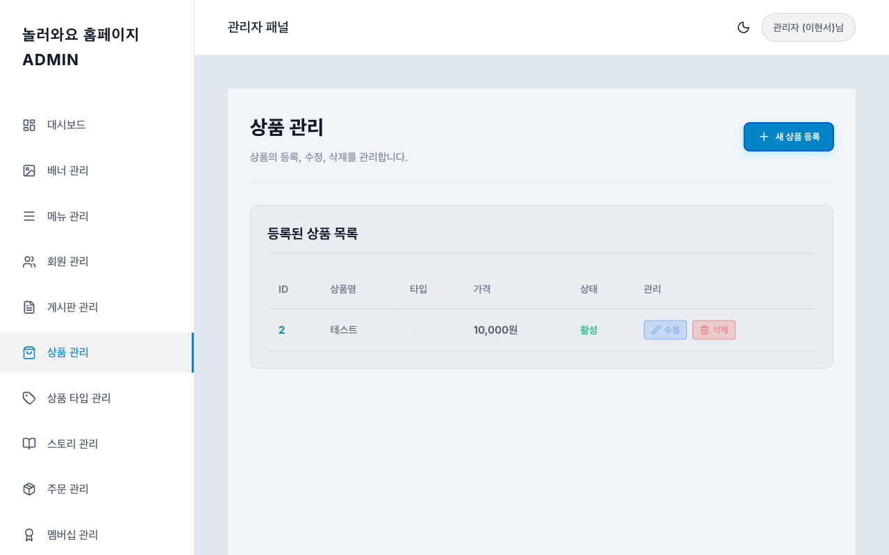
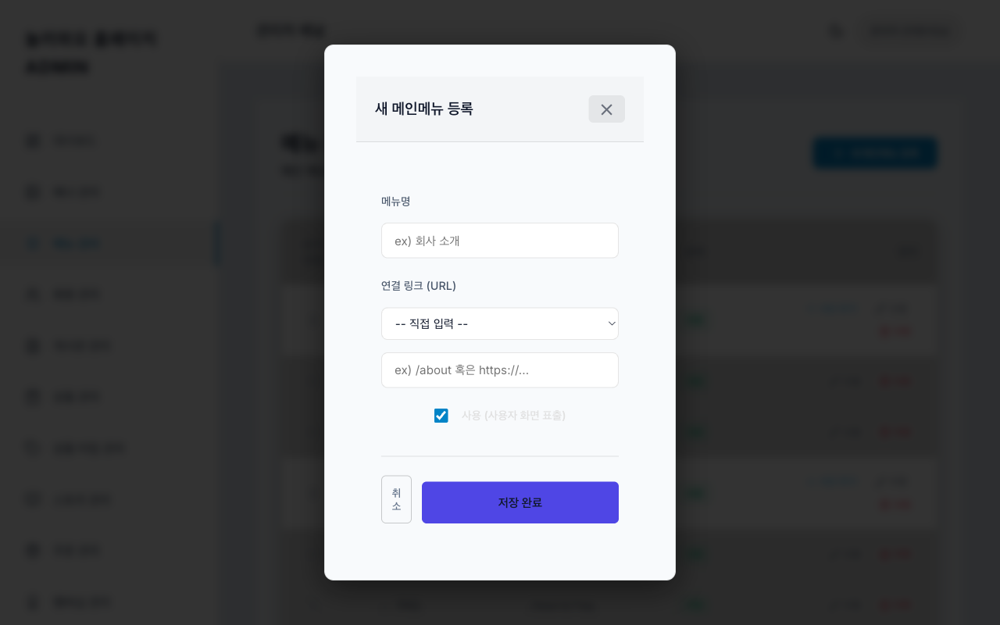
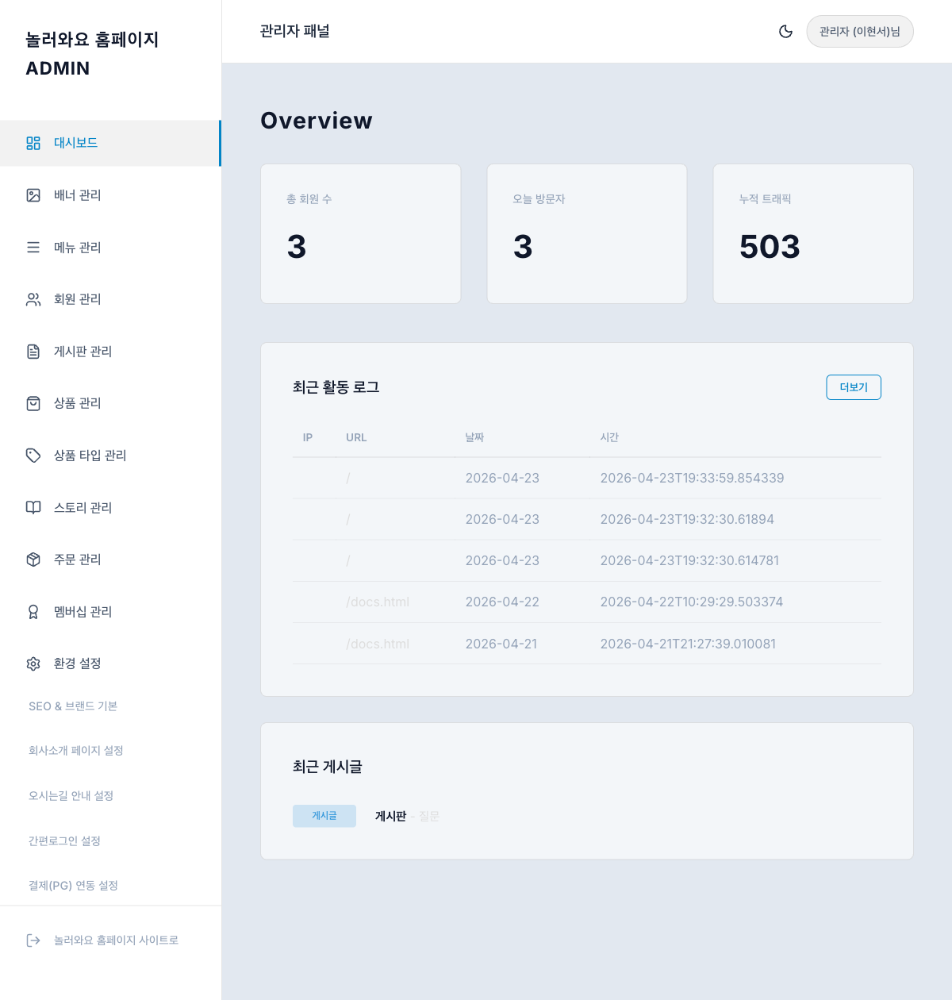

# UI/UX 테스트 보고서 (관리자 영역)

**최초 테스트:** 2026-04-21  
**재점검 일시:** 2026-04-23  
**테스트 도구:** Playwright MCP  
**테스트 대상:** http://localhost:5173/admin (관리자 영역)  
**뷰포트:** Desktop(1280x800), Mobile(375x812)

---

## 1. 테스트 결과 요약

| 구분 | 1차 (04-21) | 재점검 (04-23) |
|------|------------|--------------|
| 총 테스트 페이지 | 11개 | 15개 (신규 4개 추가) |
| 이슈 | 6건 | 1건 (미해결) |

---

## 2. 이슈 해결 현황

### ISSUE-01: 관리자 모바일 반응형 미지원 — RESOLVED

- **이전:** 사이드바가 모바일에서 항상 노출, 콘텐츠 영역 압축
- **현재:** 모바일에서 사이드바 숨김 + 햄버거 메뉴(≡) 토글로 전환

#### 수정 후 - 모바일 대시보드

#### 수정 후 - 모바일 상품 관리

### ISSUE-02: Secret Key / API Key 평문 노출 — OPEN (MEDIUM)

- **현재:** 간편로그인/결제 설정에서 Secret Key 값이 마스킹 없이 평문 표시
- **제안:** `type="password"` 적용 + 눈 아이콘 토글

### ISSUE-03: 모달 ESC 키 닫기 미지원 — RESOLVED

- **이전:** ESC 키로 모달 닫기 불가
- **현재:** ESC 키로 모달 정상 닫힘 (상품 등록/메뉴 등록 모달 확인)

#### 수정 후 - ESC 닫기 동작 확인

### ISSUE-04: 모달 버튼 색상 불일치 — PARTIALLY RESOLVED

- **이전:** 메뉴 모달 저장 버튼이 시안(cyan) 색상
- **현재:** 보라색(indigo)으로 변경됨 — 다른 모달(상품: 기본 블루)과 여전히 차이 있으나 이전보다 개선

#### 수정 후 - 메뉴 모달 버튼

### ISSUE-05: 게시판 수정 UI 불일치 — ACKNOWLEDGED (LOW)

- 게시판은 인라인 폼 유지 (디자인 의도로 판단)

### ISSUE-06: 대시보드 통계 데이터 하드코딩 — RESOLVED

- **이전:** 고정값 (1,248 / 45 / 84,302) 하드코딩
- **현재:** 실제 API 데이터 연동 (총 회원 수: 3, 오늘 방문자: 3, 누적 트래픽: 503)
- **추가 개선:** 최근 활동 로그가 실제 방문자 테이블 데이터로 표시, 최근 게시글 섹션 추가

#### 수정 후 - 대시보드

---

## 3. 신규 추가 메뉴 확인

재점검 시 다음 4개 관리자 메뉴가 새로 추가된 것을 확인:

| 메뉴 | 경로 | 상태 |
|------|------|------|
| 상품 타입 관리 | `/admin/product-categories` | 신규 |
| 스토리 관리 | `/admin/stories` | 신규 |
| 주문 관리 | `/admin/orders` | 신규 |
| 멤버십 관리 | `/admin/membership` | 신규 |

---

## 4. 콘솔 에러/경고

| 유형 | 내용 | 상태 |
|------|------|------|
| ERROR | 전체 세션 에러 0건 | OK |
| WARNING | 전체 세션 경고 0건 | OK |

---

## 5. 종합 평가 (재점검)

### 해결된 항목 (4/6)
1. **모바일 반응형** — 사이드바 토글 적용
2. **모달 ESC 닫기** — 접근성 개선
3. **대시보드 실시간 데이터** — API 연동 완료
4. **모달 버튼 색상** — 부분 개선

### 잔여 이슈 (2건)
1. **Secret Key 평문 노출** (MEDIUM) — 보안 키 마스킹 미적용
2. **모달 버튼 색상 미세 차이** (LOW) — 메뉴(indigo) vs 상품(blue)

### 점수 (재점검)

| 항목 | 1차 | 재점검 |
|------|-----|--------|
| 시각적 디자인 | 8.5 | 8.5 |
| 반응형 대응 | 4.0 | **8.5** |
| 네비게이션/라우팅 | 9.0 | 9.0 |
| 기능 완성도 | 8.0 | **9.0** |
| 보안 | 6.0 | 6.5 |
| **종합** | **7.1** | **8.3** |
