# UI/UX 테스트 보고서 (관리자 영역)

**테스트 일시:** 2026-04-21  
**테스트 도구:** Playwright MCP  
**테스트 대상:** http://localhost:5173/admin (관리자 영역)  
**뷰포트:** Desktop(1280x800), Mobile(375x812)

---

## 1. 테스트 결과 요약

| 구분 | 항목 | 결과 |
|------|------|------|
| 총 테스트 페이지 | 11개 | - |
| 정상 | 10개 | Dashboard, Banners, Menus, Members, Boards, Products, Settings(5종) |
| 이슈 발견 | 6건 | 아래 상세 참조 |

---

## 2. 페이지별 상세 평가

### 2.1 대시보드 (`/admin`)

| 항목 | 평가 | 비고 |
|------|------|------|
| 레이아웃 | OK | 좌측 사이드바 + 우측 메인 콘텐츠 2컬럼 구성 |
| 사이드바 네비게이션 | OK | 대시보드, 배너, 메뉴, 회원, 게시판, 상품 관리 + 환경 설정 하위 메뉴 |
| Overview 카드 | OK | 총 회원 수(1,248), 신규 게시글(45), 누적 트래픽(84,302) 표시 |
| 활동 로그 | OK | 새 회원, 새 게시글, 신고 접수 등 최근 로그 표시 |
| 사용자 정보 | OK | "최고관리자 (admin)님" 표시 |
| 다크 모드 | OK | 토글 시 전체 테마 전환 정상 |
| 메인으로 링크 | OK | "리테일샵 메인으로" 링크 정상 |

#### Desktop - 라이트 모드
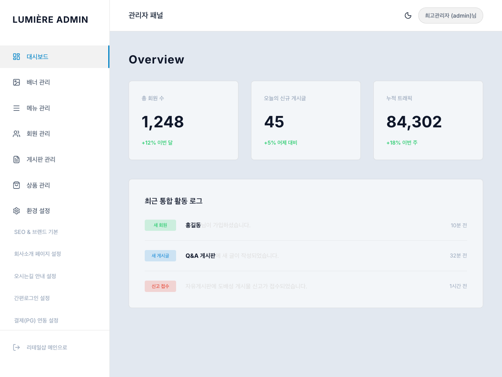

#### Desktop - 다크 모드
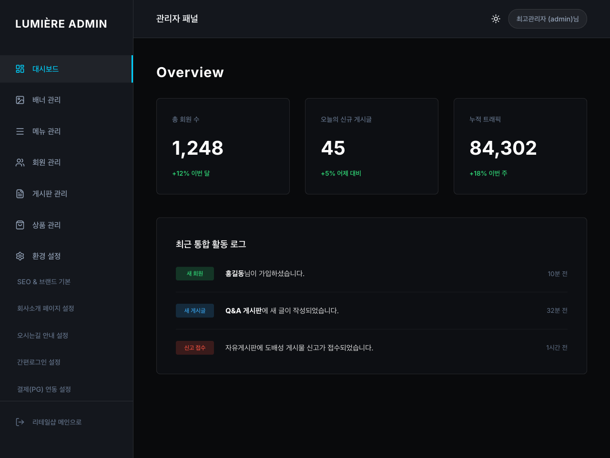

---

### 2.2 배너 관리 (`/admin/banners`)

| 항목 | 평가 | 비고 |
|------|------|------|
| 레이아웃 | OK | 카드형 배너 목록 |
| 배너 정보 | OK | 배너 이미지 미리보기, 제목, 부제목, 표출 상태 표시 |
| 관리 기능 | OK | "새 배너 등록", 수정, 삭제 버튼 제공 |
| Active 표시 | OK | 사이드바 메뉴 active 상태 하이라이트 |
| 데이터 이슈 | 주의 | 2번째 배너에 부적절한 텍스트 포함 (사용자 보고서 ISSUE-02 동일) |

#### Desktop
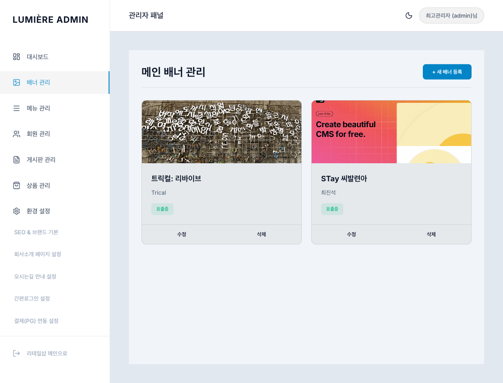

---

### 2.3 메뉴 관리 (`/admin/menus`)

| 항목 | 평가 | 비고 |
|------|------|------|
| 레이아웃 | OK | 테이블 기반 메뉴 트리 구조 |
| 메뉴 계층 | OK | 메인 메뉴 → 서브 메뉴 2뎁스 계층 표시 (들여쓰기) |
| 테이블 컬럼 | OK | 순서 조정, 메뉴 트리, 링크(URL), 상태, 관리 |
| 관리 기능 | OK | 새 메인메뉴 등록, 서브 추가, 수정, 삭제 버튼 |
| 순서 조정 | OK | 드래그 핸들 아이콘 제공 |
| 상태 표시 | OK | "표출" 배지로 활성 상태 표시 |
| 데이터 확인 | 참고 | "게시판" 메뉴의 URL이 `/board`로 설정됨 (사용자 ISSUE-01 원인) |

#### Desktop
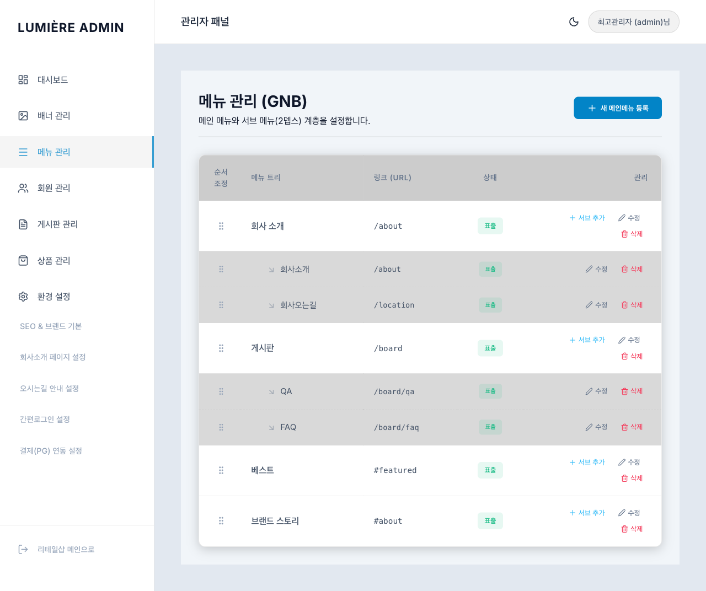

---

### 2.4 회원 관리 (`/admin/members`)

| 항목 | 평가 | 비고 |
|------|------|------|
| 레이아웃 | OK | 검색/필터 + 테이블 구성 |
| 검색 기능 | OK | 이름 검색 입력, 권한별 필터(전체/GUEST/USER/ADMIN) |
| 테이블 컬럼 | OK | 프로필, 이메일, 가입 유형, 권한, 관리 |
| 권한 변경 | OK | 콤보박스로 즉시 권한 변경 가능 (GUEST/USER/ADMIN) |
| 가입 유형 표시 | OK | NAVER, LOCAL 등 배지로 구분 |
| 삭제 기능 | OK | 각 회원 행에 삭제 버튼 제공 |

#### Desktop
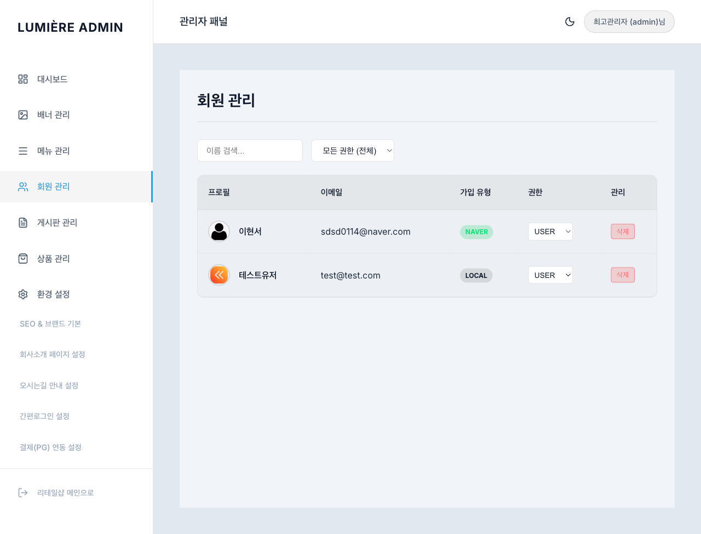

---

### 2.5 게시판 관리 (`/admin/boards`)

| 항목 | 평가 | 비고 |
|------|------|------|
| 레이아웃 | OK | 게시판 목록 테이블 + 새 게시판 생성 폼 |
| 게시판 목록 | OK | 등록된 게시판 목록 표시 |
| 생성 폼 | OK | 게시판 이름, ID, 유형, 비밀글 옵션 등 설정 가능 |
| 관리 기능 | OK | 새 게시판 등록, 수정, 삭제 |

#### Desktop
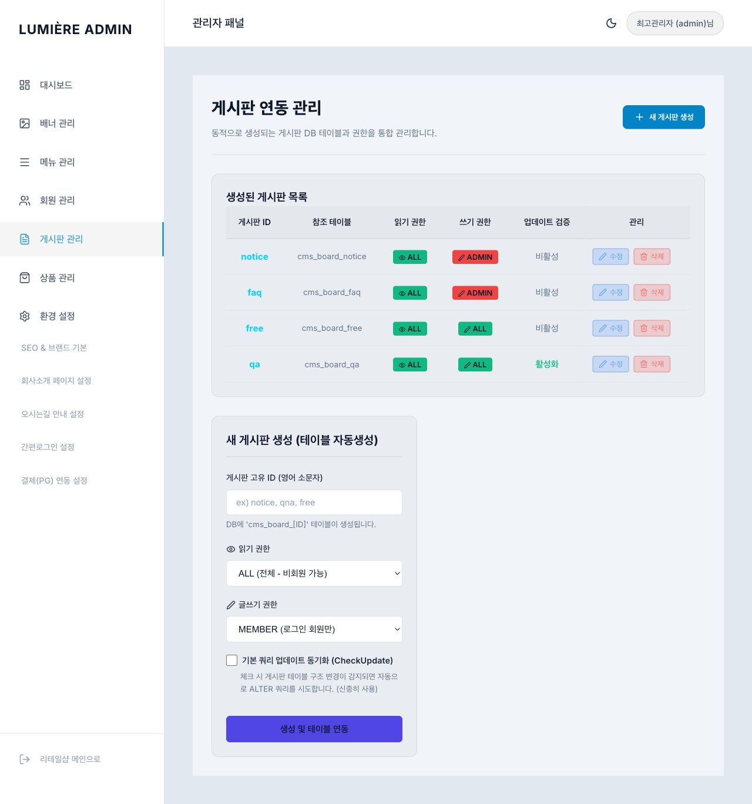

---

### 2.6 상품 관리 (`/admin/products`)

| 항목 | 평가 | 비고 |
|------|------|------|
| 레이아웃 | OK | 헤더 + 상품 목록 테이블 |
| 테이블 컬럼 | OK | ID, 상품명, 타입, 가격, 상태, 관리 |
| 타입 표시 | OK | "일반상품" 배지 표시 |
| 관리 기능 | OK | "새 상품 등록", 수정, 삭제 버튼 |
| 가격 포맷 | OK | 원화 쉼표 포맷 (10,000원) |

#### Desktop
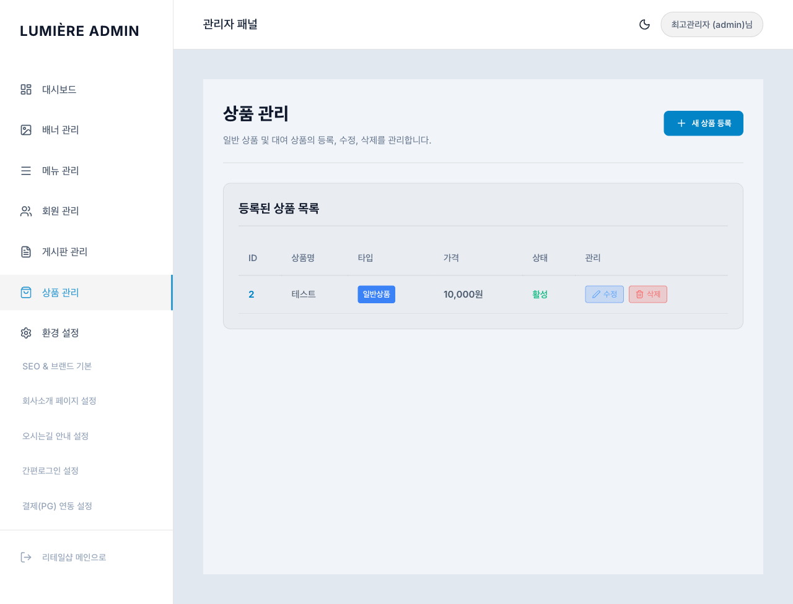

---

### 2.7 환경 설정 - SEO & 브랜드 기본 (`/admin/settings`)

| 항목 | 평가 | 비고 |
|------|------|------|
| 레이아웃 | OK | 4개 섹션 카드 그리드 |
| 섹션 구성 | OK | 1. 기본 설정(SEO) / 2. 소셜 공유 설정(Open Graph) / 3. 브랜딩 / 4. 고급 설정(Advanced) |
| 입력 필드 | OK | 사이트명, Meta Description, OG Title, 파비콘 등 |
| 저장 기능 | OK | "변경사항 저장" 버튼 |

#### Desktop
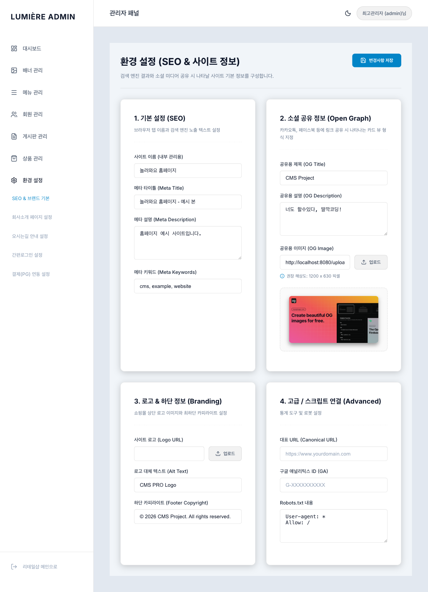

---

### 2.8 환경 설정 - 회사소개 (`/admin/settings/about`)

| 항목 | 평가 | 비고 |
|------|------|------|
| 레이아웃 | OK | 섹션별 폼 구성 |
| 섹션 구성 | OK | Hero Section, Vision & Metrics, Core Values |
| 입력 필드 | OK | 각 섹션의 제목, 본문, 수치 등 편집 가능 |

#### Desktop
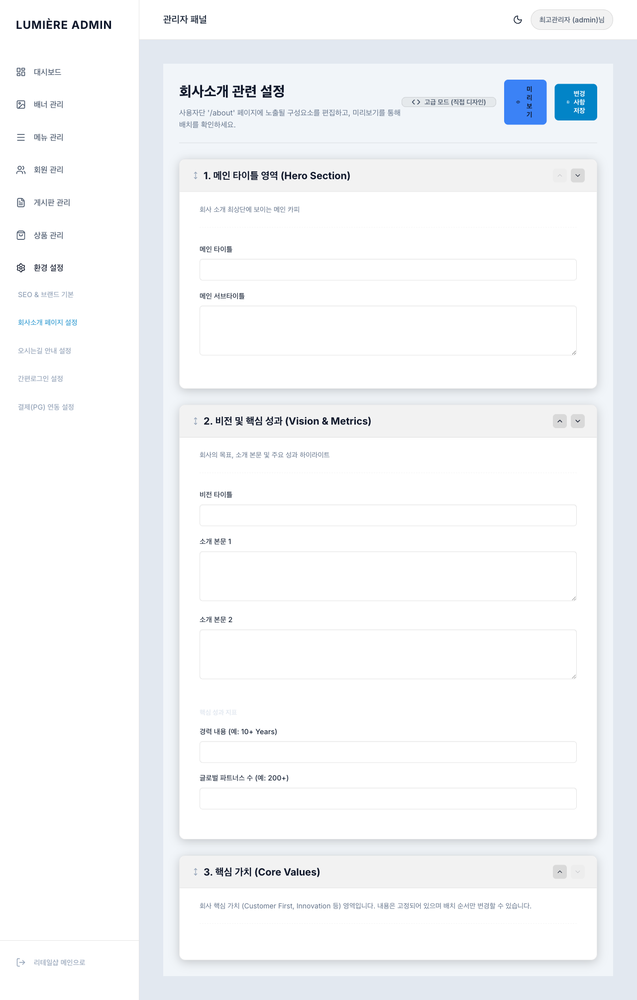

---

### 2.9 환경 설정 - 오시는길 (`/admin/settings/location`)

| 항목 | 평가 | 비고 |
|------|------|------|
| 레이아웃 | OK | 섹션별 폼 구성 |
| 섹션 구성 | OK | Hero Section, 지도 설정, 기본 연락처 및 정보, 대중교통 안내 |
| Google Maps 연동 | OK | Place ID, Zoom 레벨 설정 |

#### Desktop
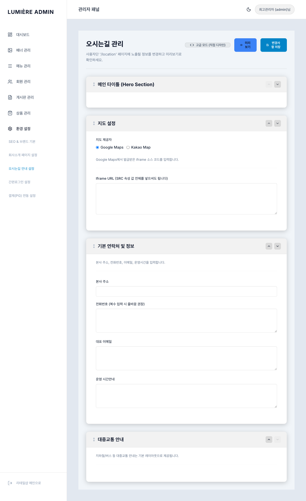

---

### 2.10 환경 설정 - 간편로그인 (`/admin/settings/social`)

| 항목 | 평가 | 비고 |
|------|------|------|
| 레이아웃 | OK | OAuth 프로바이더별 카드 구성 |
| 지원 프로바이더 | OK | Naver, Google, Kakao, GitHub, Apple 5종 |
| 설정 항목 | OK | Client ID, Client Secret, Redirect URI, 활성화 토글 |
| 보안 | 주의 | Secret Key 값이 마스킹 없이 평문 표시 |

#### Desktop
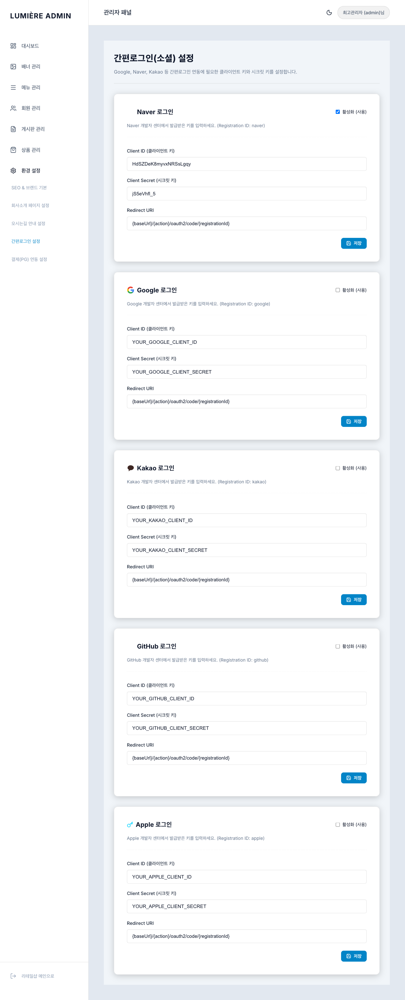

---

### 2.11 환경 설정 - 결제(PG) 연동 (`/admin/settings/payment`)

| 항목 | 평가 | 비고 |
|------|------|------|
| 레이아웃 | OK | PG사별 카드 구성 |
| 지원 PG사 | OK | NHN KCP, 카카오페이, 토스페이 3종 |
| 설정 항목 | OK | Client Key, Secret Key, CID, API URL, 활성화 토글 |
| 보안 | 주의 | 토스페이 테스트 키가 평문 노출 (test_ck_..., test_sk_...) |
| 활성 상태 | OK | 토스페이만 활성화 체크 상태 |

#### Desktop
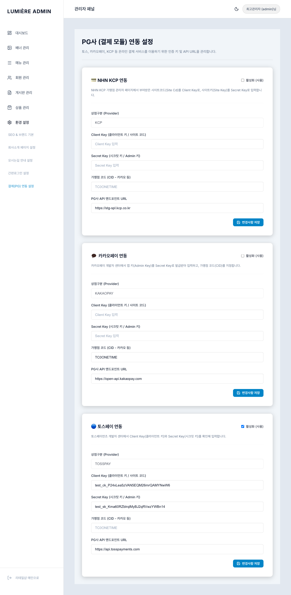

---

## 3. 모달/폼 디자인 점검

### 3.1 배너 등록 모달

| 항목 | 평가 | 비고 |
|------|------|------|
| 모달 크기 | OK | 넓은 2컬럼 레이아웃 (좌: 폼, 우: 실시간 미리보기) |
| 기본 정보 섹션 | OK | 배경 이미지 업로드, 서브/메인 타이틀, 설명글 |
| 스타일 속성 (고급) | OK | 폰트 크기, 텍스트 정렬, 타이틀/서브 색상 (컬러 피커) |
| 버튼 설정 | OK | 동적 버튼 추가/삭제, 텍스트/링크/글자색/배경색 설정 |
| 표출 설정 | OK | 전체 링크, 활성화 체크박스, 우선순위 |
| 실시간 미리보기 | OK | 입력값 변경 시 우측 미리보기 즉시 반영 |
| 닫기 기능 | OK | ✕ 버튼으로 모달 닫기 |

#### 배너 등록 모달
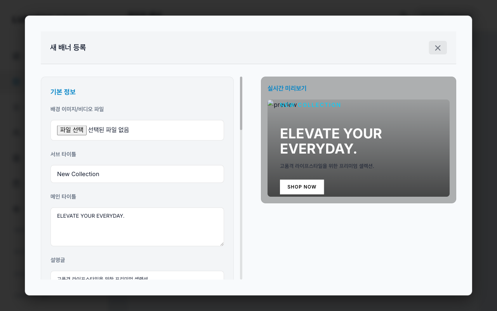

### 3.2 배너 수정 모달

| 항목 | 평가 | 비고 |
|------|------|------|
| 데이터 로드 | OK | 기존 배너 데이터(이미지, 타이틀, 버튼 등) 정상 바인딩 |
| 실시간 미리보기 | OK | 기존 이미지와 텍스트 미리보기 표시 |
| 현재 파일 표시 | OK | 업로드된 파일 경로 표시 |
| 구조 | OK | 등록 모달과 동일한 레이아웃 일관성 유지 |

#### 배너 수정 모달
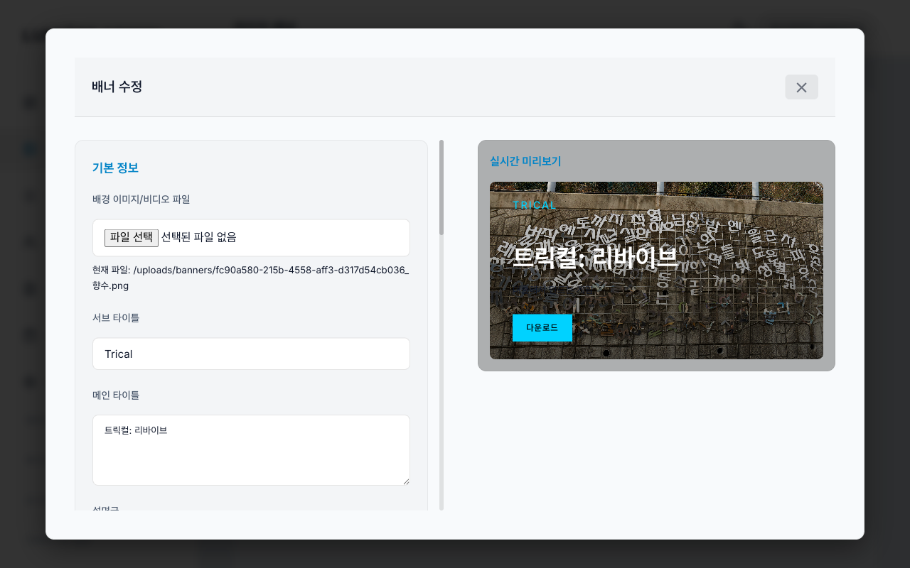

### 3.3 메뉴 등록 모달

| 항목 | 평가 | 비고 |
|------|------|------|
| 모달 크기 | OK | 중앙 정렬 컴팩트 모달 |
| 입력 필드 | OK | 메뉴명, 연결 링크(URL) |
| URL 선택 | OK | 드롭다운으로 내부 경로 선택 또는 직접 입력 가능 |
| URL 프리셋 | OK | 홈, 회사소개, 오시는길, 상품, 게시판별 경로 등 제공 |
| 표출 설정 | OK | "사용 (사용자 화면 표출)" 체크박스 |
| 버튼 | OK | 취소/저장 완료 버튼 |
| 저장 완료 버튼 색상 | 참고 | 시안(cyan) 색상 - 다른 모달의 버튼 색상과 불일치 |

#### 메뉴 등록 모달
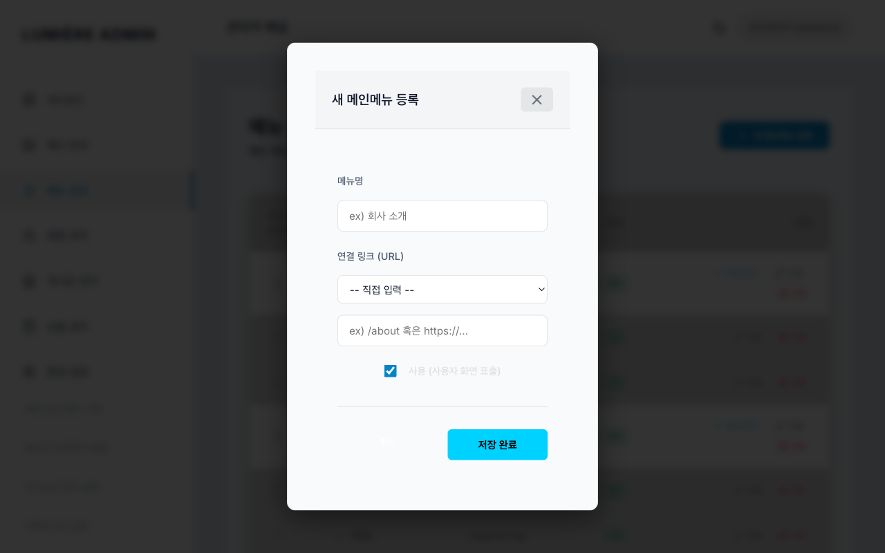

### 3.4 상품 등록 모달

| 항목 | 평가 | 비고 |
|------|------|------|
| 모달 크기 | OK | 넓은 풀사이즈 모달 |
| 입력 필드 | OK | 상품명, 타입(일반/대여), 가격, 재고 수량 |
| 리치 에디터 | OK | Quill 에디터 (Bold, Italic, 리스트, 링크, 이미지 등) |
| 이미지 업로드 | OK | 드래그앤드롭 영역 + 다중 선택 가능 안내 |
| 활성화 체크 | OK | 활성화 체크박스 |
| 버튼 | OK | 저장/취소 버튼 |

#### 상품 등록 모달
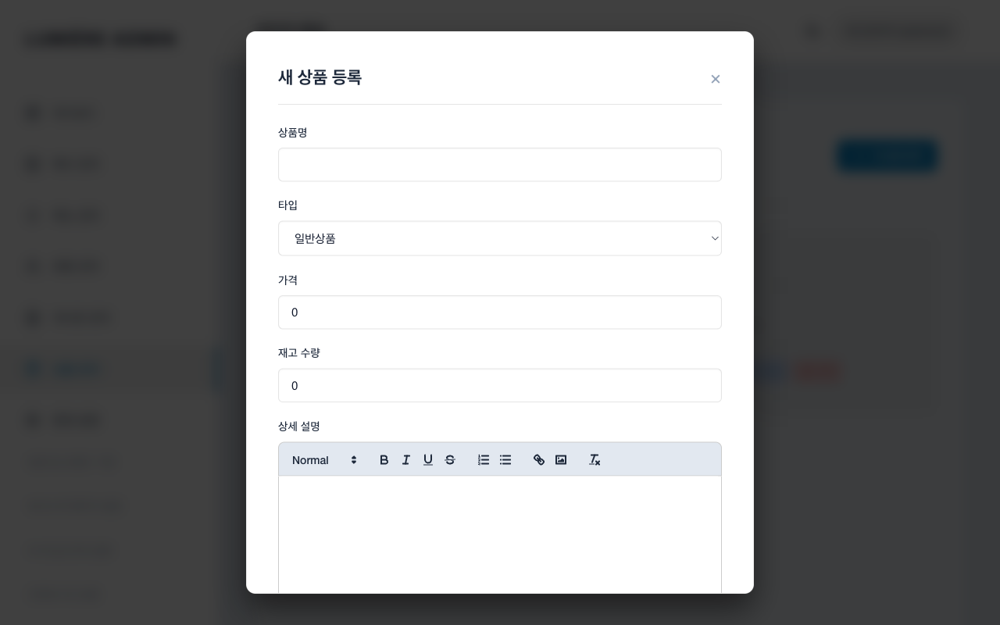

### 3.5 상품 수정 모달

| 항목 | 평가 | 비고 |
|------|------|------|
| 데이터 로드 | OK | 기존 상품 데이터(이름, 타입, 가격, 재고, 설명) 정상 바인딩 |
| 리치 에디터 | OK | 기존 상세 설명(이미지 포함) 정상 로드 |
| 구조 | OK | 등록 모달과 동일한 레이아웃 |

#### 상품 수정 모달
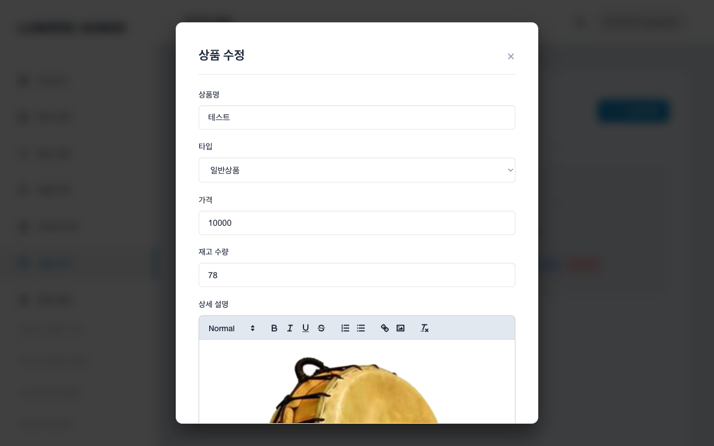

### 3.6 게시판 수정 폼

| 항목 | 평가 | 비고 |
|------|------|------|
| 표시 방식 | 인라인 | 모달이 아닌 페이지 하단 인라인 폼으로 표시 |
| 데이터 로드 | OK | 선택한 게시판의 권한 정보 정상 바인딩 |
| 일관성 | 참고 | 다른 관리 페이지(배너/상품)는 모달 사용, 게시판만 인라인 폼 |

#### 게시판 수정 폼
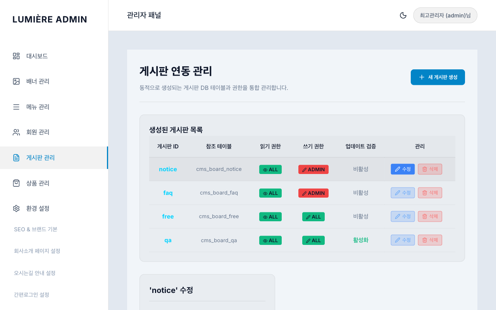

### 3.7 모달 디자인 종합 평가

| 항목 | 평가 |
|------|------|
| 오버레이 배경 | OK - 반투명 다크 오버레이 적용 |
| 닫기 버튼 | OK - 우상단 ✕ 버튼 일관 제공 |
| 폼 레이블 | OK - 각 필드에 명확한 한글 레이블 |
| 버튼 배치 | OK - 하단 좌/우 정렬 (취소/저장) |
| 버튼 색상 일관성 | 이슈 - 메뉴 모달(시안) vs 배너/상품 모달(기본) 색상 불일치 |
| 실시간 미리보기 | OK - 배너 모달에서 우수한 UX 제공 |
| ESC 키 닫기 | 미지원 - ESC 키로 모달 닫기 불가 |

---

### 4.1 모바일 반응형

### 4.1 모바일 (375x812)

| 페이지 | 평가 | 비고 |
|--------|------|------|
| 대시보드 | 이슈 | 사이드바가 항상 노출되어 콘텐츠 영역 압축, 활동 로그 텍스트 잘림 |
| 상품 관리 | 이슈 | 사이드바와 테이블 콘텐츠 겹침, 테이블 가로 스크롤 없음 |
| 메뉴 관리 | 이슈 | 테이블이 좁아 버튼 텍스트 잘림, 사이드바 겹침 |

#### 모바일 - 대시보드
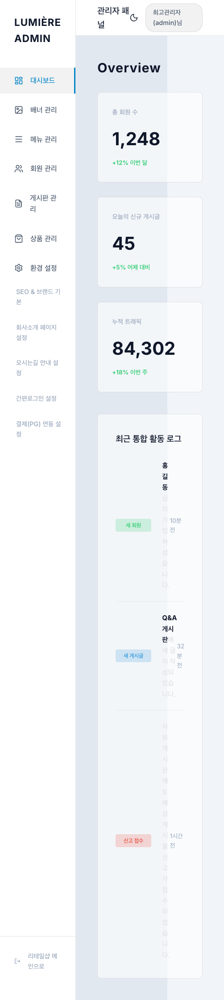

#### 모바일 - 상품 관리
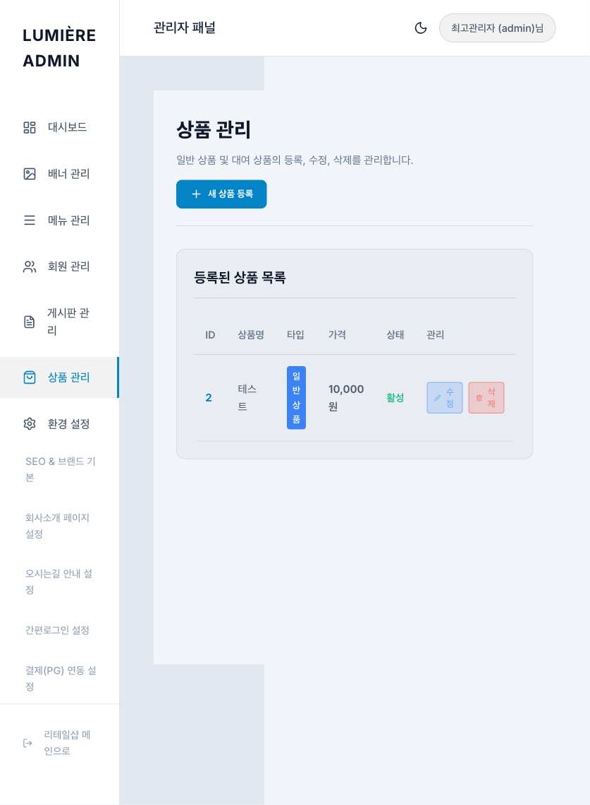

#### 모바일 - 메뉴 관리
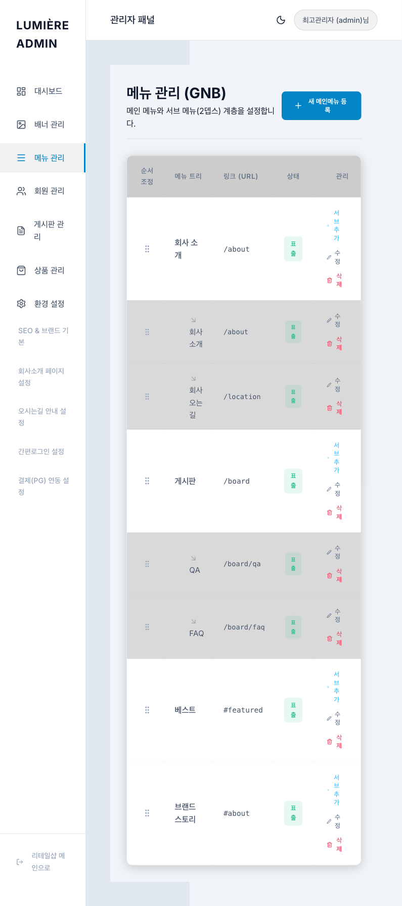

---

## 5. 발견된 이슈

### ISSUE-01: 관리자 모바일 반응형 미지원 (심각도: HIGH)

- **현상:** 모바일 뷰포트(375px)에서 사이드바가 접히지 않고 항상 노출되어 메인 콘텐츠 영역이 심하게 압축됨
- **영향:** 모바일에서 관리자 페이지 사용이 사실상 불가능 (텍스트 잘림, 테이블 가독성 저하)
- **제안:**
  - (A) 모바일에서 사이드바를 기본 숨김 + 햄버거 메뉴 토글로 전환
  - (B) 반응형 breakpoint(768px 이하)에서 사이드바 오버레이 모드 적용
  - (C) 테이블에 가로 스크롤(`overflow-x: auto`) 적용

### ISSUE-02: Secret Key / API Key 평문 노출 (심각도: MEDIUM)

- **현상:** 간편로그인 설정, 결제(PG) 연동 설정에서 Client Secret, Secret Key 값이 마스킹 없이 평문으로 표시
- **영향:** 화면 공유, 스크린샷 유출 시 보안 키 노출 위험
- **제안:**
  - (A) Secret Key 필드에 `type="password"` 적용 + 눈 아이콘으로 표시/숨김 토글
  - (B) 저장된 키는 마스킹 표시 (예: `test_sk_****Bn14`)

### ISSUE-03: 모달 ESC 키 닫기 미지원 (심각도: LOW)

- **현상:** 모달 오픈 상태에서 ESC 키를 눌러도 모달이 닫히지 않음
- **영향:** 키보드 사용자의 접근성(a11y) 저하
- **제안:** 모달 컴포넌트에 `keydown` 이벤트 리스너 추가하여 ESC 키 닫기 지원

### ISSUE-04: 모달 버튼 색상 불일치 (심각도: LOW)

- **현상:** 메뉴 등록 모달의 "저장 완료" 버튼이 시안(cyan) 색상이나, 배너/상품 모달의 저장 버튼은 기본 색상
- **영향:** 디자인 일관성 저하
- **제안:** 모든 모달의 저장/확인 버튼 색상을 통일

### ISSUE-05: 게시판 수정 UI 불일치 (심각도: LOW)

- **현상:** 배너/상품 관리는 모달 방식, 게시판 관리만 인라인 폼 방식으로 편집 UI가 상이
- **영향:** 관리자 경험의 일관성 저하
- **제안:** 게시판 수정도 모달 방식으로 통일하거나, 인라인 방식을 의도적 선택이라면 유지

### ISSUE-06: 대시보드 통계 데이터가 하드코딩 (심각도: LOW)

- **현상:** Overview 카드의 총 회원 수(1,248), 신규 게시글(45), 누적 트래픽(84,302)이 실제 데이터와 관계없이 고정값 표시
- **영향:** 관리자가 실제 현황을 파악할 수 없음
- **제안:** 백엔드 API(`/api/admin/stats`)와 연동하여 실시간 데이터 표시

---

## 6. 콘솔 에러/경고 요약

| 유형 | 내용 | 발생 조건 |
|------|------|-----------|
| - | 관리자 영역 전용 에러/경고 없음 | - |

관리자 영역에서 별도의 JavaScript 에러 또는 API 에러는 발생하지 않았습니다.

---

## 7. 종합 평가

### 긍정적 요소
- 사이드바 네비게이션이 직관적이고 계층 구조(환경 설정 하위 메뉴)가 잘 구성됨
- 모든 관리 페이지에 CRUD 기능(등록/수정/삭제)이 일관되게 제공됨
- 다크 모드가 관리자 영역에서도 완벽하게 적용됨
- Active 메뉴 하이라이트로 현재 위치를 명확하게 표시
- 게시판 관리에서 다양한 옵션(비밀글, 댓글 등) 설정 가능
- 결제 PG사 3종(KCP, 카카오페이, 토스) 통합 관리 지원
- OAuth 5종(Naver, Google, Kakao, GitHub, Apple) 관리 지원

### 개선 필요 사항
1. **모바일 반응형 대응** (ISSUE-01) - 사이드바 접힘/토글 처리 필수
2. **보안 키 마스킹** (ISSUE-02) - Secret Key 평문 노출 방지
3. **모달 ESC 키 닫기** (ISSUE-03) - 접근성 개선
4. **모달 버튼 색상 통일** (ISSUE-04) - 디자인 일관성
5. **게시판 수정 UI 통일** (ISSUE-05) - 관리자 UX 일관성
6. **대시보드 실시간 데이터 연동** (ISSUE-06) - 하드코딩 데이터 개선

### 점수

| 항목 | 점수 (10점 만점) |
|------|-----------------|
| 시각적 디자인 | 8.5 |
| 반응형 대응 | 4.0 |
| 네비게이션/라우팅 | 9.0 |
| 기능 완성도 | 8.0 |
| 보안 | 6.0 |
| **종합** | **7.1** |
