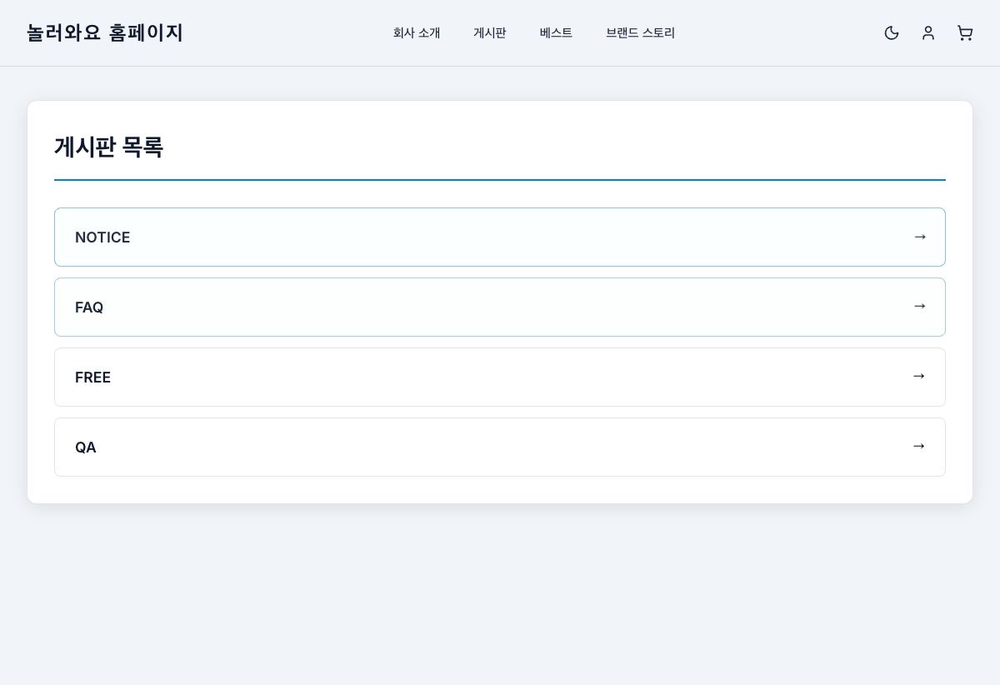
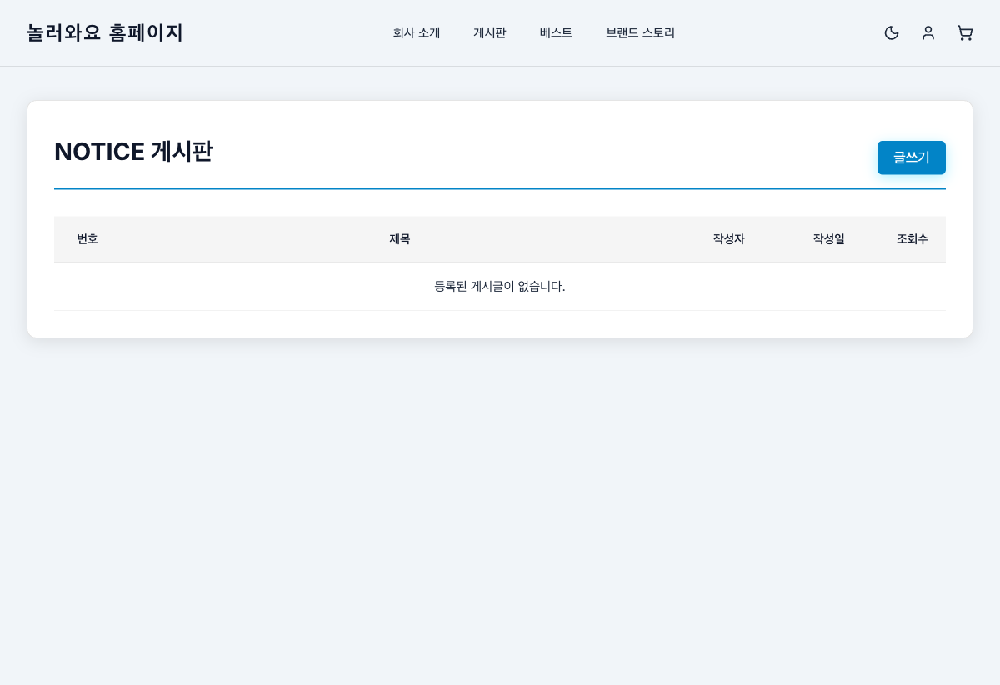
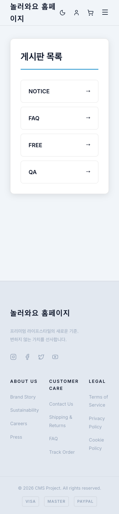
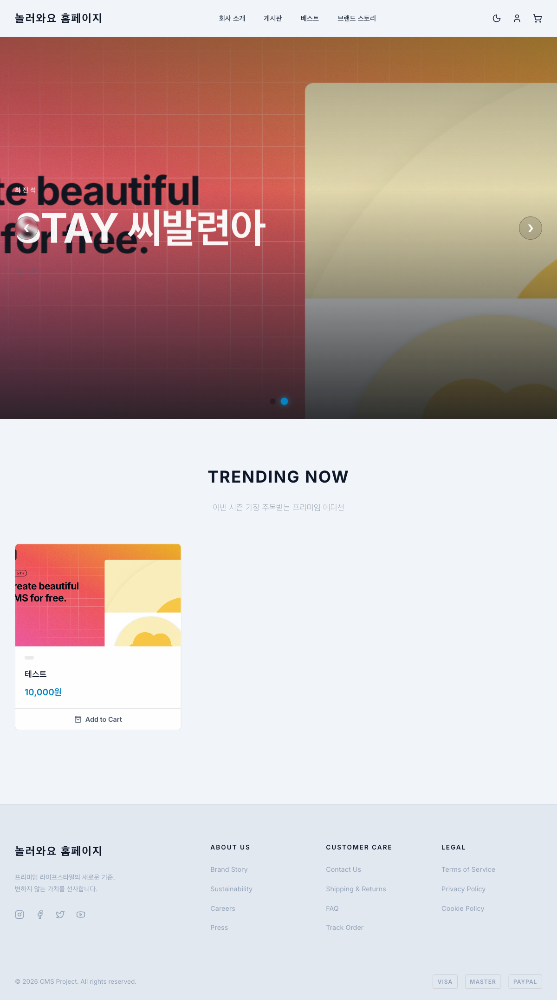
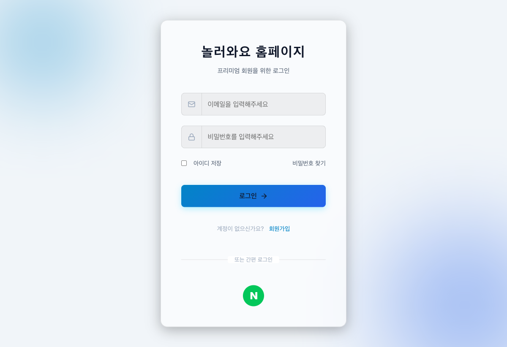
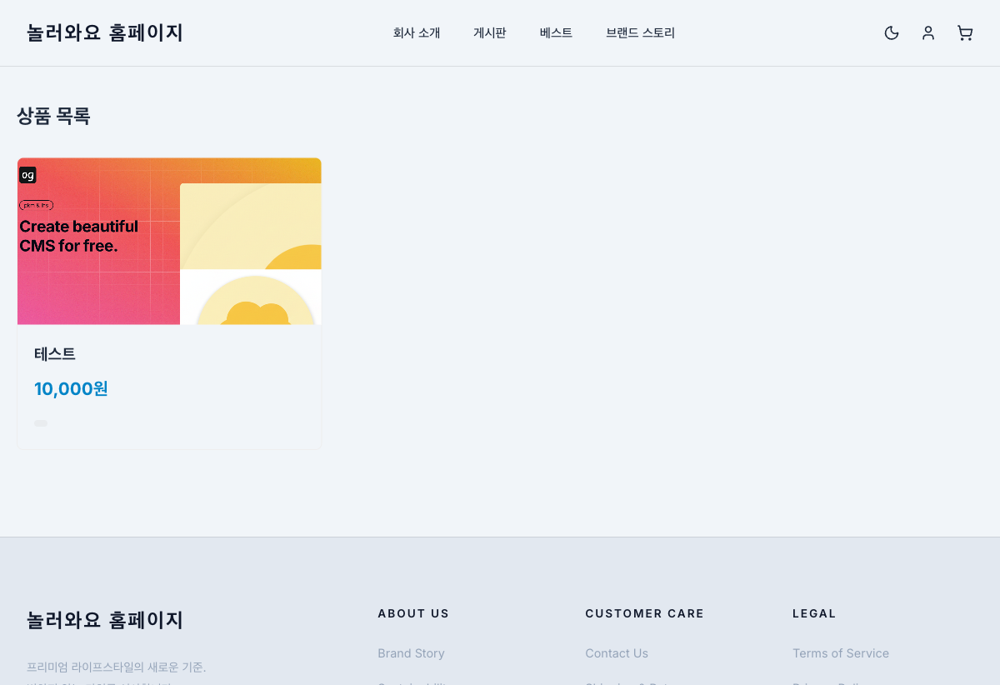
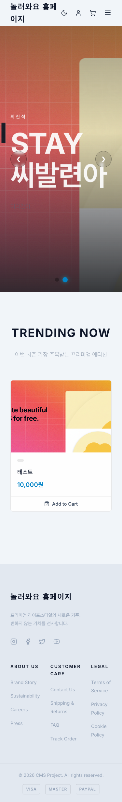

# UI/UX 테스트 보고서 (사용자 영역)

**최초 테스트:** 2026-04-21  
**재점검 일시:** 2026-04-23  
**테스트 도구:** Playwright MCP  
**테스트 대상:** http://localhost:5173 (사용자 영역)  
**뷰포트:** Desktop(1280x800), Tablet(768x1024), Mobile(375x812)

---

## 1. 테스트 결과 요약

| 구분 | 1차 (04-21) | 재점검 (04-23) |
|------|------------|--------------|
| 총 테스트 페이지 | 10개 | 11개 |
| 정상 | 7개 | 10개 |
| 이슈 | 3건 | 1건 (미해결) |

---

## 2. 이슈 해결 현황

### ISSUE-01: 게시판 메뉴 링크 라우팅 오류 — RESOLVED

- **이전:** `/board` 경로 미매칭으로 빈 페이지 표시
- **현재:** `/board` 경로에 게시판 목록 페이지 추가 (NOTICE, FAQ, FREE, QA 카드 목록)
- **콘솔 경고:** 해소됨 (`No routes matched` 경고 없음)

#### 수정 후 - 게시판 목록

#### 수정 후 - 게시판 상세 (NOTICE)

#### 수정 후 - 모바일 게시판 목록

### ISSUE-02: 배너 테스트 데이터에 부적절한 텍스트 — OPEN

- **현재:** 두 번째 배너 슬라이드에 부적절한 텍스트가 여전히 포함
- **제안:** 관리자 페이지에서 해당 배너 데이터 삭제 또는 수정

### ISSUE-03: 푸터 링크가 모두 `#`으로 연결 — OPEN (LOW)

- **현재:** 푸터의 ABOUT US, CUSTOMER CARE, LEGAL 섹션 링크가 모두 `href="#"`
- **영향:** 클릭 시 아무 동작 없음

---

## 3. 재점검 페이지별 확인

| 페이지 | 데스크톱 | 모바일 | 비고 |
|--------|---------|--------|------|
| 홈 (`/`) | OK | OK | 배너, 상품, 푸터 정상 |
| 로그인 (`/login`) | OK | - | 폼, 소셜 로그인 정상 |
| 게시판 목록 (`/board`) | OK | OK | **신규** - 4개 게시판 카드 목록 |
| 게시판 상세 (`/board/notice`) | OK | - | 테이블, 글쓰기 버튼 정상 |
| 상품 목록 (`/products`) | OK | - | 상품 카드 정상 |

#### 홈 페이지

#### 로그인 페이지

#### 상품 목록

#### 모바일 - 홈

---

## 4. 콘솔 에러/경고

| 유형 | 내용 | 상태 |
|------|------|------|
| WARNING | `No routes matched "/board"` | **해소** |
| ERROR | 전체 세션 에러 0건 | OK |

---

## 5. 종합 평가 (재점검)

### 개선된 항목
- `/board` 게시판 목록 페이지 추가 → 네비게이션 정상 동작
- 모바일에서도 게시판 목록 깔끔하게 표시

### 잔여 이슈
1. 배너 부적절한 텍스트 (데이터 문제, 코드 이슈 아님)
2. 푸터 링크 미연결 (LOW)

### 점수 (재점검)

| 항목 | 1차 | 재점검 |
|------|-----|--------|
| 시각적 디자인 | 8.5 | 8.5 |
| 반응형 대응 | 8.0 | 8.0 |
| 네비게이션/라우팅 | 6.5 | **9.0** |
| 인터랙션 | 8.0 | 8.0 |
| 에러 처리 | 7.5 | **8.5** |
| **종합** | **7.7** | **8.4** |
