# UI/UX 테스트 보고서 (사용자 영역)

**테스트 일시:** 2026-04-21  
**테스트 도구:** Playwright MCP  
**테스트 대상:** http://localhost:5173 (사용자 영역)  
**뷰포트:** Desktop(1280x800), Tablet(768x1024), Mobile(375x812)

---

## 1. 테스트 결과 요약

| 구분 | 항목 | 결과 |
|------|------|------|
| 총 테스트 페이지 | 10개 | - |
| 정상 | 7개 | Home, Login, ProductList, ProductDetail, About, Location, (인증 리다이렉트) |
| 이슈 발견 | 3건 | 아래 상세 참조 |

---

## 2. 페이지별 상세 평가

### 2.1 홈 페이지 (`/`)

| 항목 | 평가 | 비고 |
|------|------|------|
| 레이아웃 | OK | 배너 + TRENDING NOW + 푸터 3단 구성 정상 |
| 네비게이션 | 부분 이슈 | "게시판" 링크가 `/board`로 연결 (라우팅 미매칭) |
| 배너 슬라이더 | OK | 이전/다음 버튼, 인디케이터 정상 동작 |
| 추천 상품 섹션 | OK | 상품 카드 렌더링, "Add to Cart" 버튼 표시 정상 |
| 푸터 | OK | 소셜 링크, ABOUT/CUSTOMER CARE/LEGAL 섹션 정상 |
| 다크 모드 | OK | 토글 시 전체 테마 전환 정상 |
| API 요청 | OK | `/api/global/menus`, `/api/global/banners`, `/api/products`, `/api/global/setting` 모두 200 |

#### Desktop - 라이트 모드
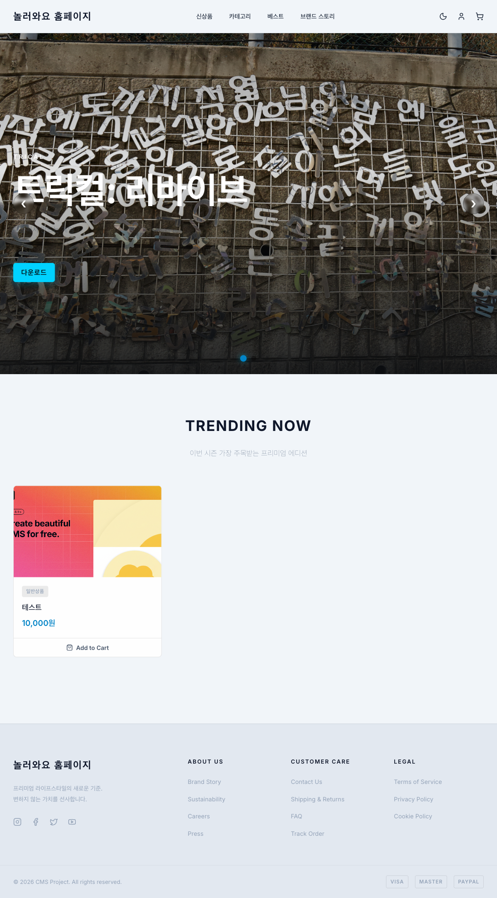

#### Desktop - 다크 모드
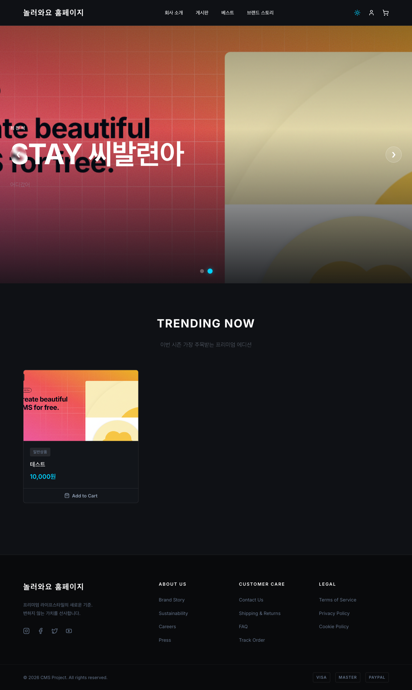

#### 배너 슬라이더 (2번째 슬라이드)
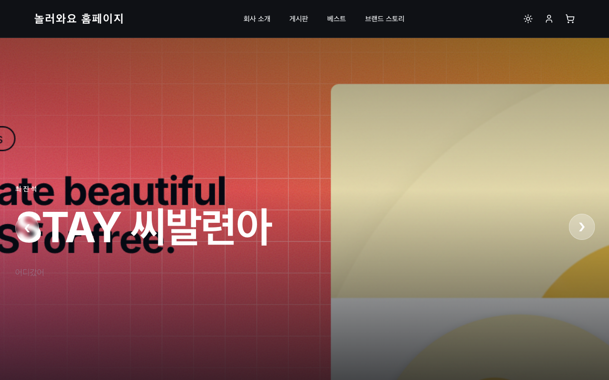

---

### 2.2 로그인 페이지 (`/login`)

| 항목 | 평가 | 비고 |
|------|------|------|
| 레이아웃 | OK | 중앙 카드형 로그인 폼 (프리미엄 디자인) |
| 폼 요소 | OK | 이메일/비밀번호 입력, 아이디 저장 체크박스, 비밀번호 찾기 |
| 로그인 버튼 | OK | 그라데이션 블루 버튼 |
| 소셜 로그인 | OK | Naver 간편 로그인 버튼 표시 |
| 회원가입 링크 | OK | `/signup`으로 연결 |

#### Desktop

---

### 2.3 상품 목록 (`/products`)

| 항목 | 평가 | 비고 |
|------|------|------|
| 레이아웃 | OK | "상품 목록" 헤더 + 상품 카드 그리드 |
| 상품 카드 | OK | 이미지, 이름, 가격, 상품 유형 태그 표시 |
| 클릭 연동 | OK | 상품 클릭 시 `/products/:id` 상세 페이지 이동 |

#### Desktop
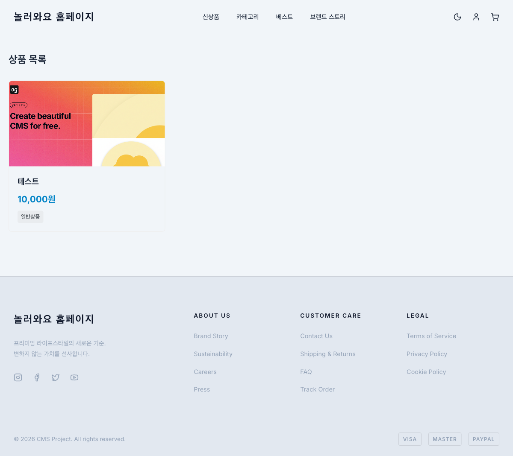

---

### 2.4 상품 상세 (`/products/:id`)

| 항목 | 평가 | 비고 |
|------|------|------|
| 레이아웃 | OK | 좌측 이미지 + 우측 정보 2컬럼 구성 |
| 상품 정보 | OK | 상품명, 가격, 수량 선택, 총 금액 표시 |
| 수량 조절 | OK | -/+ 버튼 (최소 1개에서 - 비활성화) |
| 장바구니 버튼 | OK | "장바구니 담기" 버튼 표시 |
| 상품 설명 | OK | 리치 텍스트(이미지 포함) 정상 렌더링 |

#### Desktop
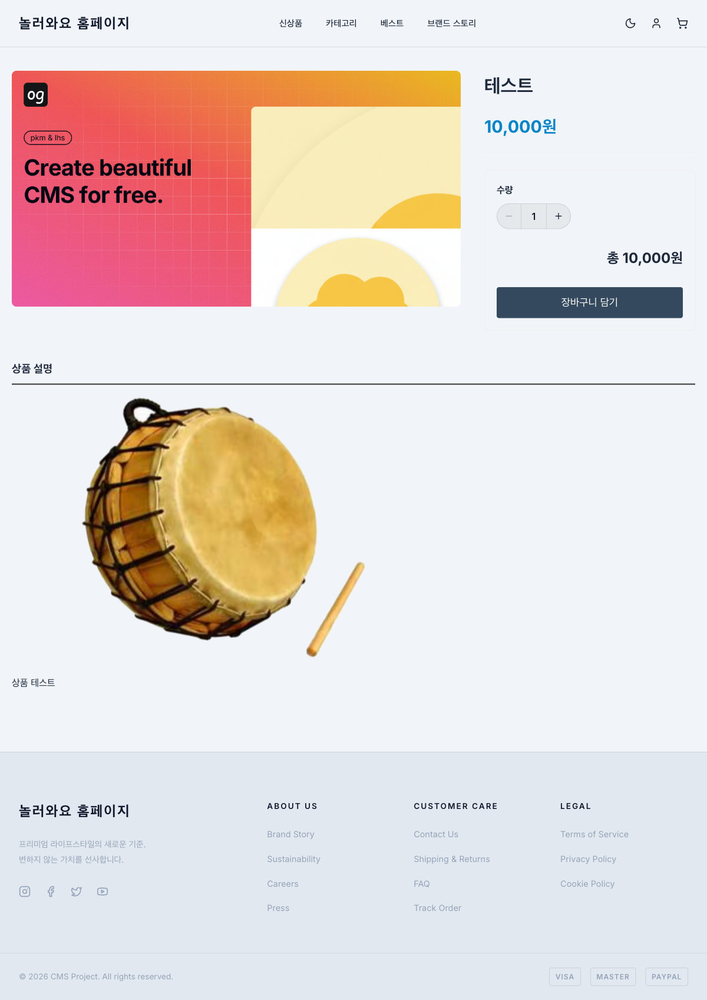

---

### 2.5 회사소개 (`/about`)

| 항목 | 평가 | 비고 |
|------|------|------|
| 레이아웃 | OK | 히어로 + Our Vision + Core Values 3단 구성 |
| 통계 수치 | OK | "10+ YEARS OF EXPERIENCE", "200+ GLOBAL PARTNERS" 표시 |
| Core Values | OK | Customer First, Innovation, Trust & Safety, Collaboration 4개 카드 |

#### Desktop
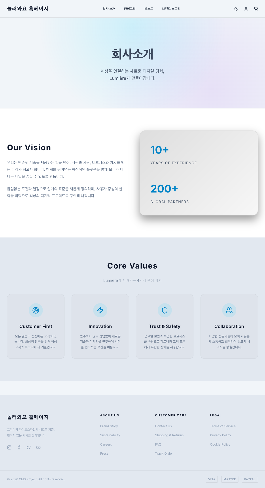

---

### 2.6 오시는 길 (`/location`)

| 항목 | 평가 | 비고 |
|------|------|------|
| 지도 | OK | Google Maps 임베드 정상 표시 |
| 연락처 정보 | OK | 주소, 전화번호, 이메일, 운영시간 4개 카드 |
| 대중교통 안내 | OK | 지하철(2호선, 신분당선), 버스(간선/지선/직행) 정보 |

#### Desktop
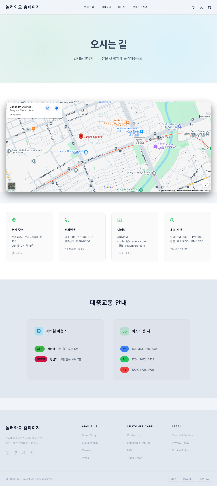

---

### 2.7 인증 필요 페이지

| 페이지 | 리다이렉트 | 평가 |
|--------|-----------|------|
| `/cart` | `/login` | OK |
| `/orders` | `/login` | OK |
| `/checkout` | `/login` | OK |
| `/mypage` | `/login` | OK |

비로그인 상태에서 인증 필요 페이지 접근 시 로그인 페이지로 정상 리다이렉트됩니다.

#### 장바구니 접근 시 로그인 리다이렉트
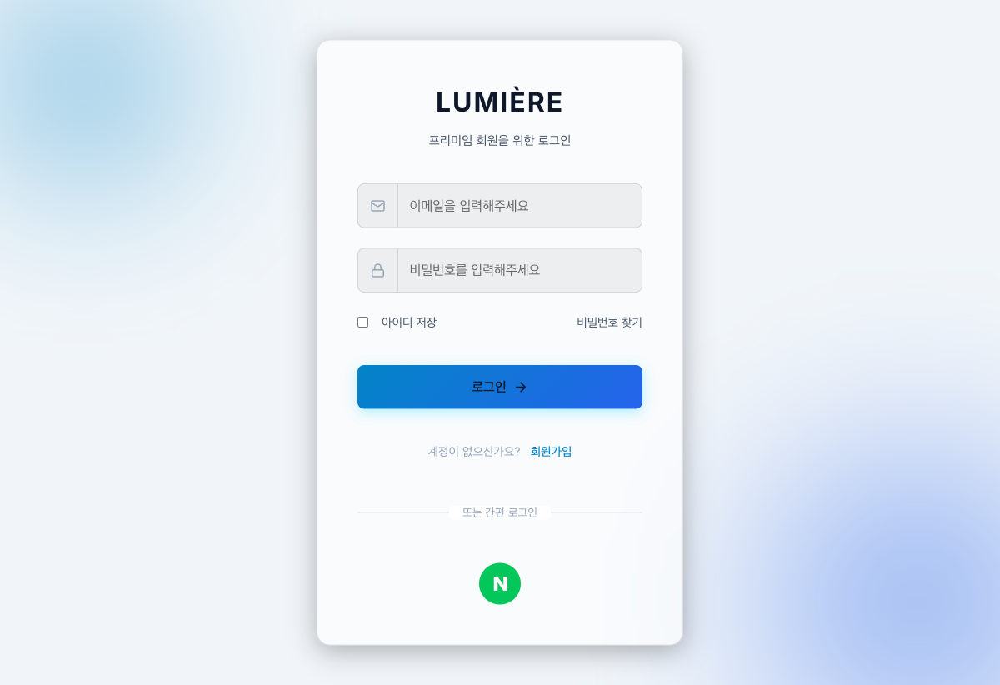

---

### 2.8 게시판 (`/board`)

| 항목 | 평가 | 비고 |
|------|------|------|
| 라우팅 | FAIL | `/board` 경로 미매칭으로 빈 페이지 표시 |

#### 빈 페이지 표시 (ISSUE-01)

---

## 3. 반응형 테스트

### 3.1 모바일 (375x812)

| 페이지 | 평가 | 비고 |
|--------|------|------|
| 홈 | OK | 햄버거 메뉴 버튼 표시, 배너/상품 1컬럼 적응 |
| 로그인 | OK | 카드 폼이 모바일 너비에 맞게 축소, 터치 친화적 |
| 상품 목록 | OK | 1컬럼 카드 레이아웃 |
| 상품 상세 | OK | 이미지/정보 세로 배치로 전환 |
| 회사소개 | OK | 섹션별 세로 배치, 가독성 양호 |
| 오시는 길 | OK | 지도/정보 카드 세로 배치 |

#### 모바일 - 홈
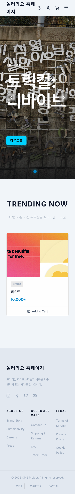

#### 모바일 - 로그인
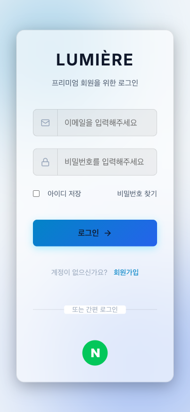

#### 모바일 - 상품 목록
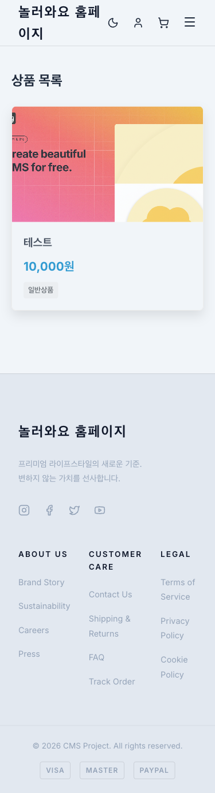

#### 모바일 - 상품 상세
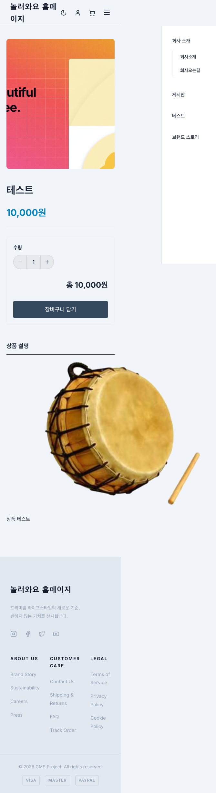

#### 모바일 - 회사소개
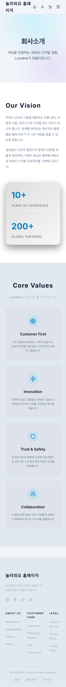

#### 모바일 - 오시는 길
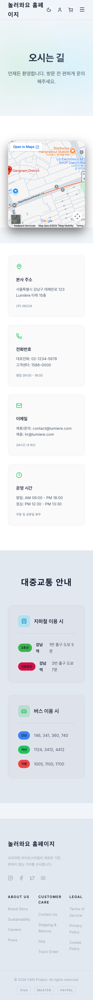

### 3.2 태블릿 (768x1024)

| 페이지 | 평가 | 비고 |
|--------|------|------|
| 홈 | OK | 데스크톱과 유사한 레이아웃 유지 |

#### 태블릿 - 홈
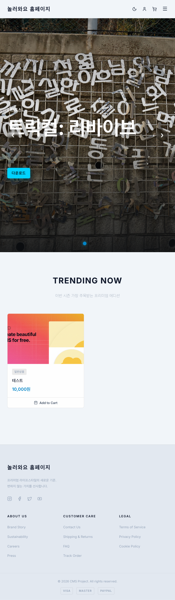

---

## 4. 발견된 이슈

### ISSUE-01: 게시판 메뉴 링크 라우팅 오류 (심각도: HIGH)

- **현상:** 네비게이션 메뉴의 "게시판" 링크가 `/board`로 연결되나, 라우터에 `/board/:boardId` 패턴만 정의되어 있어 빈 페이지 표시
- **콘솔:** `No routes matched location "/board"` 경고
- **영향:** 사용자가 메뉴에서 게시판을 클릭하면 빈 화면만 보임
- **제안:** 
  - (A) `/board` 경로에 게시판 목록(보드 선택) 페이지 추가
  - (B) 메뉴에서 게시판 링크를 특정 boardId로 변경 (예: `/board/1`)
  - (C) 메뉴 데이터에서 동적으로 하위 메뉴를 생성하여 각 게시판으로 연결

### ISSUE-02: 배너 테스트 데이터에 부적절한 텍스트 (심각도: MEDIUM)

- **현상:** 두 번째 배너 슬라이드에 부적절한 텍스트("STay 씨발련아") 포함
- **영향:** 운영 환경에 배포 시 사용자에게 노출될 위험
- **제안:** 관리자 페이지에서 해당 배너 데이터 삭제 또는 수정

### ISSUE-03: 푸터 링크가 모두 `#`으로 연결 (심각도: LOW)

- **현상:** 푸터의 ABOUT US, CUSTOMER CARE, LEGAL 섹션 링크가 모두 `href="#"`
- **영향:** 클릭 시 아무 동작 없음 (페이지 상단으로만 스크롤)
- **제안:** 해당 페이지 구현 또는 링크 제거

---

## 5. 콘솔 에러/경고 요약

| 유형 | 내용 | 발생 조건 |
|------|------|-----------|
| ERROR | `401 Unauthorized` on `/api/cart` | 비로그인 상태에서 장바구니 접근 (정상 동작) |
| WARNING | `No routes matched location "/board"` | 게시판 메뉴 클릭 시 (ISSUE-01) |

---

## 6. 종합 평가

### 긍정적 요소
- 전반적으로 깔끔한 프리미엄 디자인 톤 유지
- 다크 모드 전환이 자연스럽고 모든 요소에 일관 적용
- 모바일/태블릿 반응형이 잘 구현되어 있음
- 인증이 필요한 페이지의 리다이렉트가 정상 동작
- API 호출이 안정적 (홈 페이지 4개 API 모두 200 OK)
- 상품 상세의 수량 조절, 총 가격 계산 등 인터랙션이 정상 동작

### 개선 필요 사항
1. **게시판 라우팅 수정** (ISSUE-01) - 사용자 접근 불가 상태
2. **테스트 데이터 정리** (ISSUE-02) - 운영 배포 전 필수
3. **푸터 링크 실제 연결** (ISSUE-03) - 완성도 향상

### 점수

| 항목 | 점수 (10점 만점) |
|------|-----------------|
| 시각적 디자인 | 8.5 |
| 반응형 대응 | 8.0 |
| 네비게이션/라우팅 | 6.5 |
| 인터랙션 | 8.0 |
| 에러 처리 | 7.5 |
| **종합** | **7.7** |
